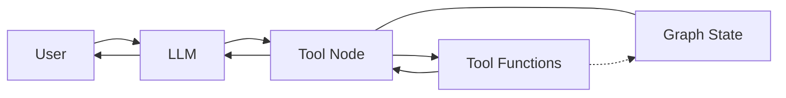
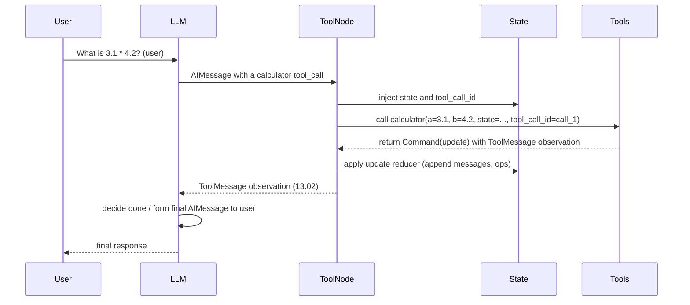
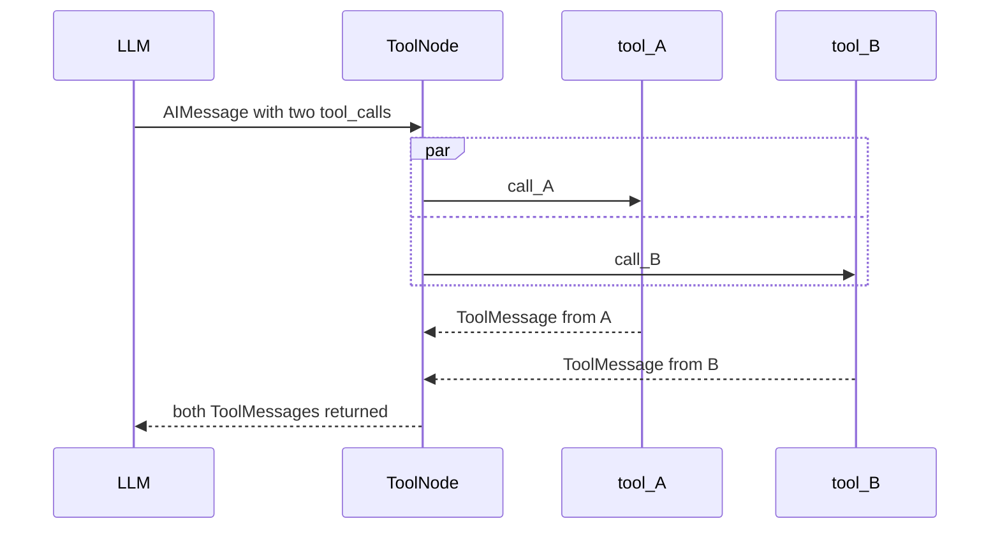

<style>
/* Lightweight styling for markdown rendered in viewers that support inline HTML */
body { font-family: -apple-system, BlinkMacSystemFont, 'Segoe UI', Roboto, 'Helvetica Neue', Arial; color: #0b1220; }
h1#top { font-size: 2.2rem; color: #0b61ff; margin-bottom: 0.2rem; }
h2.section { color: #0b61ff; border-bottom: 1px solid #e6eefc; padding-bottom: 0.25rem; }
.toc { background:#f7fbff; padding:12px; border:1px solid #e6eefc; border-radius:6px; }
.toc a { color:#0b61ff; text-decoration:none; }
.back-to-top { font-size:0.85rem; margin-top:0.5rem; display:block; }
code, pre { background:#f6f8fb; padding:3px 6px; border-radius:4px; }
</style>

<h1 id="top">0_create_agent.ipynb — Detailed Summary</h1>

<h2 class="section">Overview</h2>

<p>This document provides an in-depth summary of <code>notebooks/0_create_agent.ipynb</code>. It contains conceptual explanations, Mermaid diagrams for architecture and sequence flows, code excerpts and runnable examples, edge cases, and suggested next steps.</p>

<div class="toc">
<strong>Table of contents</strong>
<ul>
    <li><a href="#introduction">Introduction</a></li>
    <li><a href="#architecture">Architecture (Mermaid diagrams)</a>
        <ul>
            <li><a href="#arch-high">High-level component diagram</a></li>
            <li><a href="#arch-seq">Runtime sequence diagram</a></li>
            <li><a href="#arch-par">Tool-node parallel execution diagram</a></li>
        </ul>
    </li>
    <li><a href="#concepts">Key concepts explained</a></li>
    <li><a href="#examples">Example code snippets</a></li>
    <li><a href="#edgecases">Edge cases and defensive patterns</a></li>
    <li><a href="#nextsteps">Suggested experiments and next steps</a></li>
    <li><a href="#references">References</a></li>
</ul>
</div>

<h2 id="introduction" class="section">Introduction</h2>

The notebook demonstrates how to build a ReAct-style agent using LangGraph's `create_react_agent` pre-built abstraction. The agent is composed of an LLM, a set of tools, and a prompt. Tools are executed by a ToolNode and the outputs are returned to the LLM as `ToolMessage`s. State is represented by a typed `AgentState` and can be extended and updated safely using reducers and Commands.

<h2 id="architecture" class="section">Architecture</h2>

<h3 id="arch-high">High-level component diagram (what runs and how they connect):</h3>



<h3 id="arch-seq">Runtime sequence diagram (detailed steps of a single agent run):</h3>



<h3 id="arch-par">Tool-node parallel execution (two tool calls executed in parallel):</h3>



<h2 id="concepts" class="section">Key concepts explained</h2>

<h3>ReAct loop</h3>
<ul>
    <li>The LLM reasons and decides whether to call tools. Each tool call is embedded into an <code>AIMessage</code> as <code>tool_calls</code>.</li>
    <li>The <code>ToolNode</code> executes the tool calls, collects results as <code>ToolMessage</code>s and appends them to <code>state.messages</code>.</li>
    <li>The LLM sees the <code>ToolMessage</code>s and uses them to continue reasoning until it emits a final answer.</li>
</ul>

<h3>Tools and annotations</h3>
<ul>
    <li>Tools are ordinary Python functions decorated with <code>@tool</code> from LangChain/LangGraph.</li>
    <li>Annotations used in the notebook:
        <ul>
            <li><code>InjectedState</code> — marks a parameter as runtime-injected state (not included in description presented to the LLM).</li>
            <li><code>InjectedToolCallId</code> — marks a parameter that will receive the tool_call_id for correlating returned <code>ToolMessage</code>(s) to the originating call.</li>
        </ul>
    </li>
 </ul>

<h3>Graph state and reducers</h3>
<ul>
    <li><code>AgentState</code> holds <code>messages: Sequence[BaseMessage]</code> and other fields like <code>remaining_steps</code>.</li>
    <li>Extend <code>AgentState</code> to create <code>CalcState</code> and add <code>ops: Annotated[List[str], reduce_list]</code> where <code>reduce_list</code> safely concatenates lists.</li>
    <li>Reducers ensure safe concurrent updates when parallel tool calls update shared state.</li>
</ul>

<h3>InjectedState and InjectedToolCallId</h3>
<ul>
    <li>Use <code>InjectedState</code> to provide state to tools without exposing it to the LLM prompt.</li>
    <li>Use <code>InjectedToolCallId</code> so tools can create <code>ToolMessage(..., tool_call_id=tool_call_id)</code> which allows correlation of tool outputs.</li>
</ul>

<h3>Commands and ToolMessage</h3>
<ul>
    <li>Tools can return <code>Command(update={...})</code> to atomically update the graph state (for example, append an <code>ops</code> entry and a <code>ToolMessage</code>).</li>
    <li><code>ToolMessage</code> objects become visible in <code>state.messages</code> and are visible to the LLM in subsequent reasoning steps.</li>
</ul>

<h2 id="examples" class="section">Example code snippets</h2>

<h3>Calculator (simple)</h3>

```python
from langchain_core.tools import tool

@tool
def calculator(operation: Literal["add","subtract","multiply","divide"], a: Union[int,float], b: Union[int,float]):
    if operation == 'divide' and b == 0:
        return {"error": "Division by zero is not allowed."}
    if operation == 'add':
        return a + b
    if operation == 'subtract':
        return a - b
    if operation == 'multiply':
        return a * b
    if operation == 'divide':
        return a / b
    return "unknown operation"
```

Calculator with state and returning a Command

```python
from typing import Annotated
from langgraph.prebuilt.chat_agent_executor import AgentState
from langchain_core.messages import ToolMessage
from langchain_core.tools import tool, InjectedToolCallId
from langgraph.prebuilt import InjectedState
from langgraph.types import Command


def reduce_list(left: list | None, right: list | None) -> list:
    if not left:
        left = []
    if not right:
        right = []
    return left + right

class CalcState(AgentState):
    ops: Annotated[List[str], reduce_list]

@tool
def calculator_wstate(
    operation: Literal["add","subtract","multiply","divide"],
    a: Union[int,float],
    b: Union[int,float],
    state: Annotated[CalcState, InjectedState],
    tool_call_id: Annotated[str, InjectedToolCallId]
) -> Union[int,float,Command]:
    # Perform same checks as calculator
    if operation == 'divide' and b == 0:
        return {"error": "Division by zero is not allowed."}
    if operation == 'add':
        result = a + b
    elif operation == 'subtract':
        result = a - b
    elif operation == 'multiply':
        result = a * b
    elif operation == 'divide':
        result = a / b
    else:
        result = "unknown operation"

    ops = [f"({operation}, {a}, {b})," ]
    return Command(update={
        "ops": ops,
        "messages": [
            ToolMessage(f"{result}", tool_call_id=tool_call_id)
        ],
    })
```

Creating the agent and invoking it

```python
from langgraph.prebuilt import create_react_agent
from langchain_ollama import ChatOllama

SYSTEM_PROMPT = "You are a helpful arithmetic assistant who is an expert at using a calculator."

# Use the ChatOllama client to point at your local Ollama model.
# Replace '<your-model-name>' with the model name listed by `ollama list`.
model = ChatOllama(model="<your-model-name>", temperature=0.0)
tools = [calculator_wstate]

agent = create_react_agent(
    model,
    tools,
    prompt=SYSTEM_PROMPT,
    state_schema=CalcState,
).with_config({"recursion_limit": 20})

result = agent.invoke({
    "messages": [
        {"role": "user", "content": "What is 3.1 * 4.2?"}
    ]
})

# Inspect messages
from langchain_core.messages import messages_to_dict
print(messages_to_dict(result["messages"]))
```

<h2 id="edgecases" class="section">Edge cases and defensive patterns</h2>
<ul>
    <li>Input validation: check divide by zero and invalid operations inside tools.</li>
    <li>Reducer safety: always handle <code>None</code> values and return predictable types.</li>
    <li>Tool return types: ensure tools either return a plain result or a <code>Command</code> for state updates. Returning inconsistent types can confuse the ToolNode.</li>
    <li>Parallel updates: use reducers for any list/dict state members updated by tools in parallel.</li>
</ul>

<h2 id="nextsteps" class="section">Suggested experiments and next steps</h2>
<ul>
    <li>Add a <code>square</code> operation and test it.</li>
    <li>Introduce a pre-hook that summarizes message history and verify the LLM still functions.</li>
    <li>Add a <code>response_format</code> node to return structured responses.</li>
    <li>Try switching to a local Ollama model and run a smoke test.</li>
    <li>Add unit tests for the tools.</li>
</ul>

<h2 id="references" class="section">References</h2>
<ul>
    <li>LangGraph prebuilt agent docs: https://langchain-ai.github.io/langgraph/agents/</li>
    <li>ReAct paper: https://arxiv.org/abs/2210.03629</li>
</ul>


---

<h2 id="notes" class="section">Notes</h2>
Suggested experiments and next steps

- Add a `square` operation and test it.
- Introduce a pre-hook that summarizes message history and verify the LLM still functions.
- Add a `response_format` node to return structured responses.
- Verify local Ollama usage:
    - Install `langchain-ollama` (you already added it):

```bash
pip install langchain-ollama
```

    - Run `ollama list` to see available local models and replace `<your-model-name>` accordingly.

```bash
ollama list
```

- Add unit tests for the tools.