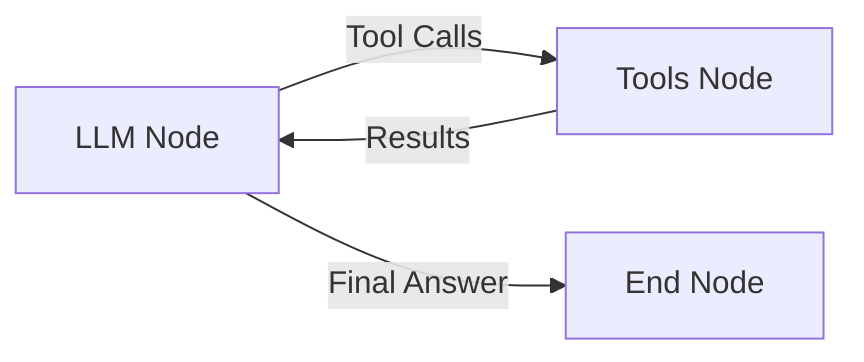
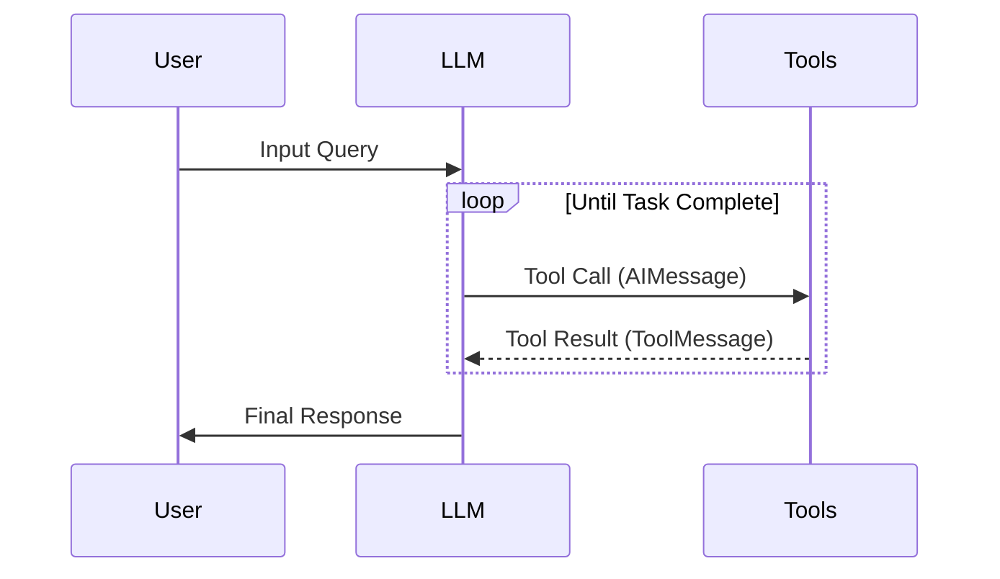
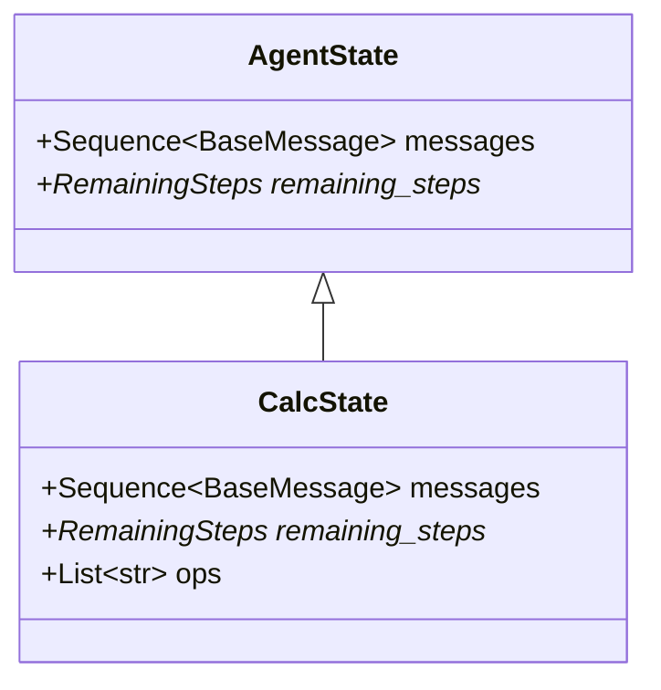

# Creating a React Agent in LangGraph

This document summarizes the key concepts and implementation details for creating a React Agent using LangGraph's prebuilt components.

## Core Concepts

### 1. ReAct Agent Overview



A ReAct agent combines:
- **Reasoning**: Chain-of-thought processing
- **Acting**: External tool usage
- **Language Model**: Core decision-making component
- **Tools**: External capabilities the agent can use
- **Prompt**: Instructions and context for operation

### 2. Agent Operation Cycle



1. **Context Examination**: LLM reviews available tools and current context
2. **Tool Selection**: Decides if and which tool to use
3. **Tool Execution**: Forms and sends tool calls
4. **Result Processing**: Interprets tool results
5. **Continuation Decision**: Determines if more tools needed or task complete

## Implementation Details

### 1. Basic Agent Creation

```python
from langgraph.prebuilt import create_react_agent
from langchain_ollama import ChatOllama

# Initialize model
model = ChatOllama(model="llama3.2:3b", temperature=0.0)

# Create agent
agent = create_react_agent(
    model,
    tools,
    prompt=SYSTEM_PROMPT,
    state_schema=AgentState
).with_config({"recursion_limit": 20})
```

### 2. State Management



#### Components:
1. **Base State (AgentState)**
   - `messages`: Sequence of communication messages
   - `remaining_steps`: Track iteration count
   
2. **Extended State (CalcState)**
   - Inherits AgentState
   - Adds custom fields (e.g., `ops` for operation history)
   - Uses reducers for state updates

### 3. Tool Implementation

#### Basic Tool
```python
@tool
def calculator(
    operation: Literal["add","subtract","multiply","divide"],
    a: Union[int, float],
    b: Union[int, float]
) -> Union[int, float]:
    """Calculator tool implementation"""
    # Tool logic here
    return result
```

#### State-Aware Tool
```python
@tool
def calculator_wstate(
    operation: Literal["add","subtract","multiply","divide"],
    a: Union[int, float],
    b: Union[int, float],
    state: Annotated[CalcState, InjectedState],
    tool_call_id: Annotated[str, InjectedToolCallId]
) -> Command:
    """State-aware calculator implementation"""
    # Tool logic here
    return Command(
        update={
            "ops": [operation_record],
            "messages": [ToolMessage(result, tool_call_id)]
        }
    )
```

## Advanced Features

### 1. Message Flow

1. **AIMessage Structure**
```python
AIMessage(
    content="",
    tool_calls=[{
        "id": "call_123",
        "name": "calculator",
        "args": {"a": 3.1, "b": 4.2, "operation": "multiply"}
    }]
)
```

2. **ToolMessage Structure**
```python
ToolMessage(
    content="13.02",
    tool_call_id="call_123"
)
```

### 2. State Management Extensions

#### Custom Reducer Example
```python
def reduce_list(left: list | None, right: list | None) -> list:
    """Safely combine two lists"""
    if not left: left = []
    if not right: right = []
    return left + right

class CustomState(AgentState):
    custom_field: Annotated[List[str], reduce_list]
```

### 3. Advanced Capabilities

1. **Hooks**
   - Pre-hooks: Process before LLM
   - Post-hooks: Process after LLM, before tools
   - Response formatting: Structure final output

2. **Integration Features**
   - Memory integration
   - Human-in-the-loop control
   - Streaming support
   - Deployment tooling
   - LangSmith integration for tracing and evaluation
   - Visual IDE support through LangGraph Studio

## Key Features

1. **Memory Integration**
   - Short-term (session-based) memory
   - Long-term (persistent) memory
   - Context management

2. **Human-in-the-Loop Control**
   - Asynchronous approval
   - Correction mechanisms
   - Intervention points

3. **Deployment Options**
   - Infrastructure-free deployment
   - Multiple deployment configurations
   - Production-ready tooling

## Best Practices

1. **Tool Design**
   - Write clear, specific tool descriptions
   - Use strong type hints
   - Include comprehensive docstrings
   - Implement proper error handling

2. **State Management**
   - Choose appropriate reducers
   - Keep state minimal but sufficient
   - Consider parallel execution implications

3. **Performance Optimization**
   - Set appropriate recursion limits
   - Batch tool calls when possible
   - Use state efficiently
   - Monitor tool execution

## Example Implementations

### 1. Simple Calculator Agent
```python
# Basic implementation
result = agent.invoke({
    "messages": [{
        "role": "user",
        "content": "What is 3.1 * 4.2?",
    }],
})
```

### 2. Multi-Step Calculation
```python
# Complex calculation
result = agent.invoke({
    "messages": [{
        "role": "user",
        "content": "What is 3.1 * 4.2 + 5.5 * 6.5?",
    }],
})
```

### 3. State Tracking
```python
# Operation tracking
{
    "messages": [...],
    "ops": ["(multiply, 3.1, 4.2)", "(multiply, 5.5, 6.5)", "(add, 13.02, 35.75)"]
}
```

## Debugging and Monitoring

1. **LangSmith Integration**
   - Trace execution flow
   - Monitor tool calls
   - Analyze performance
   - Debug issues

2. **Studio Visualization**
   - Visual workflow inspection
   - Real-time monitoring
   - Interactive debugging

3. **Error Handling**
   - Tool execution errors
   - State management issues
   - Recursion limits
   - Input validation