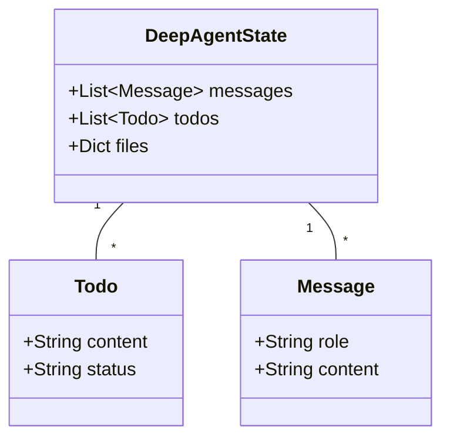
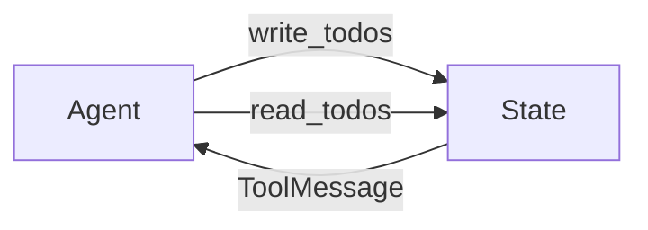

# Todo Management in Deep Agents

This document summarizes the key concepts and learnings from the implementation of TODO management in deep agents.

## Core Concepts

### 1. Purpose of TODO Lists in Agents
- Acts as a critical navigation tool for long-running, complex tasks
- Helps prevent context rot and mission drift during lengthy conversations
- Maintains focus through continuous rewriting and updating of objectives
- Essential for managing tasks that require approximately 50 tool calls

### 2. State Management
The state management system consists of three primary elements:



#### Components:
1. **Messages**
   - Inherited from `AgentState`
   - Uses `add_messages` reducer for appending new messages
   
2. **Todo**
   - Structured as a list of tasks
   - Each task contains:
     - `content`: Description of the task
     - `status`: One of ["pending", "in_progress", "completed"]
   - Uses direct overwrite for updates

3. **Files**
   - Virtual file system stored in state
   - Uses `file_reducer` for merging updates

### 3. Todo Management Tools

Two primary tools are implemented for todo management:



1. **write_todos Tool**
   - Purpose: Creates or updates the todo list
   - Behavior: 
     - Takes a list of todos as input
     - Overwrites previous list in state
     - Returns a ToolMessage with confirmation
   - Uses InjectedToolCallId for message tracking

2. **read_todos Tool**
   - Purpose: Retrieves current todo list
   - Behavior:
     - Reads todos from state
     - Formats with status emojis
     - Returns formatted string output
   - Uses InjectedState for state access

### 4. Status Visualization
Todo items are displayed with status indicators:
- ⏳ Pending
- 🔄 In Progress
- ✅ Completed

## Best Practices

1. **Task Management**
   - Keep tasks specific and actionable
   - Update status regularly to track progress
   - Reconsider and adjust tasks as progress is made

2. **Context Management**
   - Regularly review and update todo lists
   - Use todo recitation after each task completion
   - Maintain focus through structured task tracking

3. **State Updates**
   - Use complete list updates rather than individual task updates
   - Leverage reducer functions for efficient state management
   - Maintain consistency in state updates

## Implementation Details

### State Schema
```python
class Todo(TypedDict):
    content: str
    status: Literal["pending", "in_progress", "completed"]

class DeepAgentState(AgentState):
    todos: NotRequired[list[Todo]]
    files: Annotated[NotRequired[dict[str, str]], file_reducer]
```

### Key Features
1. Type safety through TypedDict implementation
2. Flexible state management with NotRequired fields
3. Custom reducers for specialized state updates
4. Integration with LangGraph's AgentState

## Practical Applications

1. **Complex Task Management**
   - Breaking down large tasks into manageable steps
   - Tracking progress across multiple operations
   - Maintaining focus on long-running tasks

2. **Context Preservation**
   - Preventing context rot in long conversations
   - Maintaining task awareness across multiple interactions
   - Ensuring completion of all planned objectives

3. **Workflow Organization**
   - Structured approach to task execution
   - Clear progress tracking and status updates
   - Efficient state management and updates

## Integration with React Agent

The todo management system integrates seamlessly with the React agent pattern:
1. Uses create_react_agent for agent creation
2. Incorporates custom tools for todo management
3. Maintains state consistency through reducers
4. Provides clear visibility into task progress

## Detailed Implementation Examples

### 1. Todo Creation and Management

```python
# Example of creating a todo list
todos = [
    {
        "content": "Research Model Context Protocol",
        "status": "pending"
    },
    {
        "content": "Analyze findings and prepare summary",
        "status": "not_started"
    }
]

# Using write_todos tool
write_todos(todos=todos)

# Reading current todos
current_todos = read_todos()
```

### 2. State Implementation

```python
# Complete implementation of Todo TypeDict and State
class Todo(TypedDict):
    """A structured task item for tracking progress through complex workflows."""
    content: str
    status: Literal["pending", "in_progress", "completed"]

def file_reducer(left, right):
    """Merge two file dictionaries, with right side taking precedence."""
    if left is None:
        return right
    elif right is None:
        return left
    else:
        return {**left, **right}

class DeepAgentState(AgentState):
    """Extended agent state with task tracking and virtual file system."""
    todos: NotRequired[list[Todo]]
    files: Annotated[NotRequired[dict[str, str]], file_reducer]
```

### 3. Tool Implementation Example

```python
@tool(description=WRITE_TODOS_DESCRIPTION)
def write_todos(
    todos: list[Todo], 
    tool_call_id: Annotated[str, InjectedToolCallId]
) -> Command:
    """Create or update the agent's TODO list."""
    return Command(
        update={
            "todos": todos,
            "messages": [
                ToolMessage(
                    f"Updated todo list to {todos}", 
                    tool_call_id=tool_call_id
                )
            ],
        }
    )
```

## Prompt Templates and Instructions

### 1. Write Todos Description
```markdown
Create and manage structured task lists for tracking progress through complex workflows.

## When to Use
- Multi-step or non-trivial tasks requiring coordination
- When user provides multiple tasks or explicitly requests todo list  
- Avoid for single, trivial actions unless directed otherwise

## Structure
- Maintain one list containing multiple todo objects (content, status, id)
- Use clear, actionable content descriptions
- Status must be: pending, in_progress, or completed

## Best Practices  
- Only one in_progress task at a time
- Mark completed immediately when task is fully done
- Always send the full updated list when making changes
- Prune irrelevant items to keep list focused
```

### 2. Todo Usage Instructions
```markdown
Based upon the user's request:
1. Use the write_todos tool to create TODO at the start of a user request
2. After accomplishing a TODO, use read_todos to remind yourself of the plan
3. Reflect on what you've done and the TODO
4. Mark your task as completed, and proceed to the next TODO
5. Continue this process until all TODOs are completed

IMPORTANT: 
- Always create a research plan of TODOs for ANY user request
- Aim to batch research tasks into a *single TODO* to minimize tracking overhead
```

## Examples of Agent Interaction

### Simple Research Task
```python
# Initial State
state = {
    "messages": [
        {
            "role": "user",
            "content": "Give me a short summary of the Model Context Protocol (MCP)."
        }
    ],
    "todos": []
}

# Agent creates todos
todos = [
    {
        "content": "Search for MCP information",
        "status": "pending"
    },
    {
        "content": "Compile and summarize findings",
        "status": "pending"
    }
]

# Agent updates state and proceeds with research
write_todos(todos)

# After completing search
todos[0]["status"] = "completed"
write_todos(todos)

# Final summary and completion
todos[1]["status"] = "completed"
write_todos(todos)
```

### Best Practices for Implementation

1. **Error Handling**
```python
def validate_todos(todos: list[Todo]) -> bool:
    """Validate todo list structure and contents."""
    valid_statuses = {"pending", "in_progress", "completed"}
    return all(
        isinstance(todo.get("content"), str) and
        todo.get("status") in valid_statuses
        for todo in todos
    )
```

2. **State Updates**
```python
def update_todo_status(todos: list[Todo], index: int, new_status: str) -> list[Todo]:
    """Update status of a specific todo while maintaining immutability."""
    return [
        {**todo, "status": new_status} if i == index else todo
        for i, todo in enumerate(todos)
    ]
```

3. **Progress Tracking**
```python
def get_progress_summary(todos: list[Todo]) -> dict:
    """Generate summary of todo list progress."""
    status_count = {
        "pending": 0,
        "in_progress": 0,
        "completed": 0
    }
    for todo in todos:
        status_count[todo["status"]] += 1
    return status_count
```