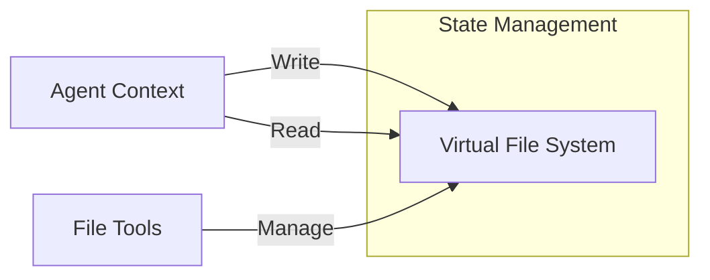
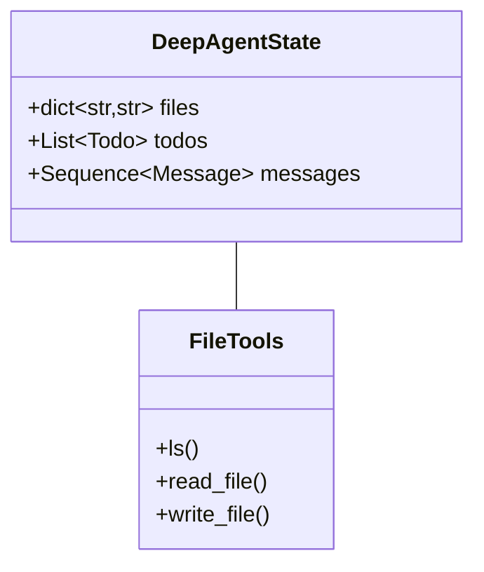
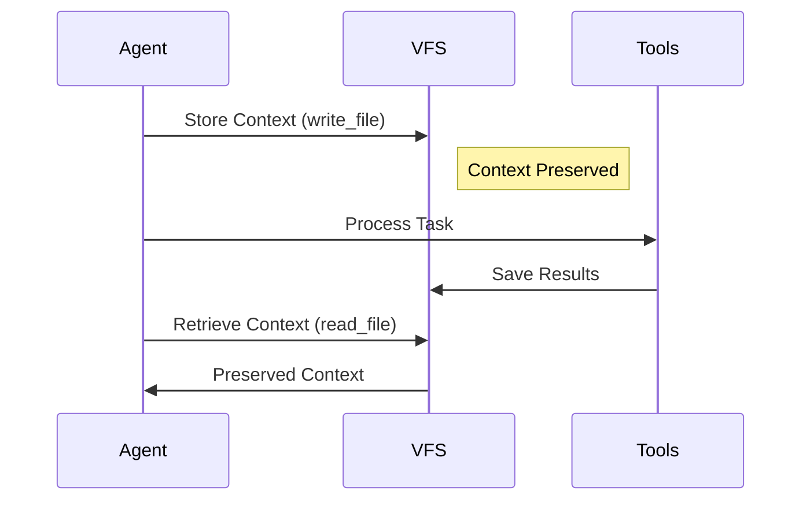

# Virtual File System in Deep Agents

This document summarizes the implementation and usage of virtual file systems for context management in deep agents.

## Core Concepts

### 1. Context Offloading Overview



Context offloading helps manage:
- Large context windows in complex tasks
- ~50 tool calls in average tasks
- Information preservation and retrieval
- Clean context for new agent instances

### 2. Virtual File System Architecture



## Implementation Details

### 1. State Management

```python
class DeepAgentState(AgentState):
    """Extended agent state with virtual file system"""
    todos: NotRequired[list[Todo]]
    files: Annotated[NotRequired[dict[str, str]], file_reducer]
```

#### File Reducer
```python
def file_reducer(left, right):
    """Merge file dictionaries with right precedence"""
    if left is None:
        return right
    elif right is None:
        return left
    else:
        return {**left, **right}
```

### 2. Core File Operations

1. **List Files (ls)**
   ```python
   @tool(description=LS_DESCRIPTION)
   def ls(state: Annotated[DeepAgentState, InjectedState]) -> list[str]:
       """List all files in virtual filesystem"""
       return list(state.get("files", {}).keys())
   ```

2. **Read File**
   ```python
   @tool(description=READ_FILE_DESCRIPTION)
   def read_file(
       file_path: str,
       state: Annotated[DeepAgentState, InjectedState],
       offset: int = 0,
       limit: int = 2000
   ) -> str:
       """Read file with pagination support"""
   ```

3. **Write File**
   ```python
   @tool(description=WRITE_FILE_DESCRIPTION)
   def write_file(
       file_path: str,
       content: str,
       state: Annotated[DeepAgentState, InjectedState],
       tool_call_id: Annotated[str, InjectedToolCallId]
   ) -> Command:
       """Write content to virtual filesystem"""
   ```

## Usage Patterns

### 1. Basic Workflow



1. **Context Storage**
   - Store important information immediately
   - Use meaningful file paths
   - Include metadata when relevant

2. **Information Retrieval**
   - Read files as needed
   - Use pagination for large files
   - Verify file existence before operations

### 2. Advanced Features

1. **Pagination Support**
   ```python
   # Reading large files in chunks
   read_file(
       file_path="large_doc.txt",
       offset=100,    # Start at line 100
       limit=50       # Read 50 lines
   )
   ```

2. **Error Handling**
   - File not found handling
   - Empty file detection
   - Line offset validation

## Best Practices

### 1. File Management

1. **Organization**
   - Use descriptive file names
   - Implement consistent naming conventions
   - Group related files logically

2. **Content Management**
   - Store one concept per file
   - Include metadata when relevant
   - Use plain text format

### 2. Performance Optimization

1. **Content Size**
   - Limit line length (2000 chars)
   - Use pagination for large files
   - Implement content truncation

2. **State Updates**
   - Use reducer for file updates
   - Maintain atomic operations
   - Verify state updates

## Example Usage

### 1. Basic Research Task
```python
# Store user request
write_file(
    "user_request.txt",
    "Research query about MCP protocol"
)

# List available files
files = ls()

# Read stored request
content = read_file("user_request.txt")
```

### 2. Context Management
```python
# Store research results
write_file(
    "research_results.txt",
    "Findings from research..."
)

# Read specific section
content = read_file(
    "research_results.txt",
    offset=10,
    limit=20
)
```

## Integration with LangGraph

### 1. State Updates
```python
Command(
    update={
        "files": updated_files,
        "messages": [ToolMessage(...)]
    }
)
```

### 2. Tool Configuration
```python
tools = [ls, read_file, write_file]
agent = create_react_agent(
    model,
    tools,
    prompt=INSTRUCTIONS,
    state_schema=DeepAgentState
)
```

## Real-World Applications

1. **Research Agents**
   - Store intermediate findings
   - Maintain research plans
   - Track progress

2. **Multi-Agent Systems**
   - Share context between agents
   - Prevent information degradation
   - Maintain clean agent contexts

3. **Long-Running Tasks**
   - Preserve context across sessions
   - Manage token limitations
   - Enable task resumption