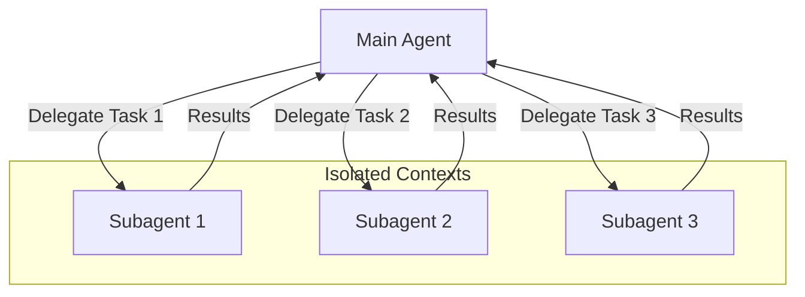
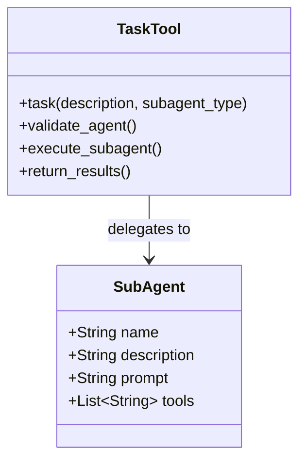
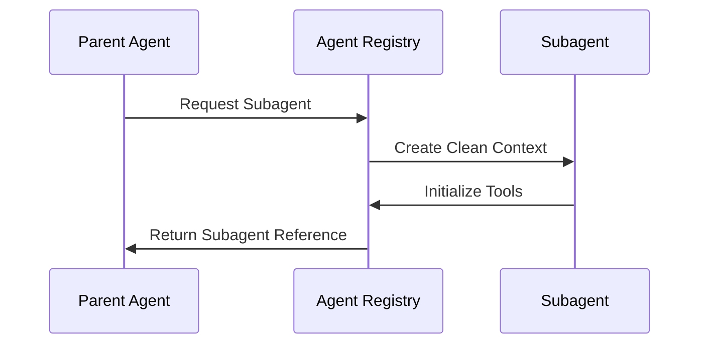
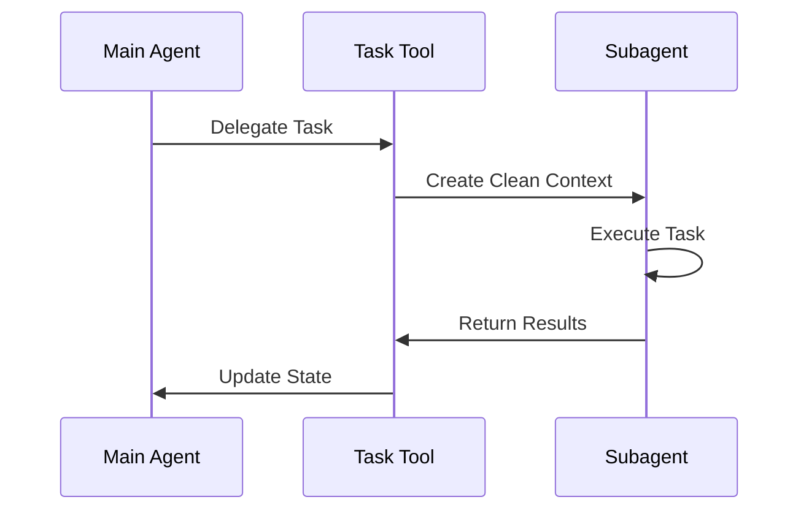

# Subagents in Deep Learning Systems

This document summarizes the implementation and concepts of subagents for context isolation in deep learning systems.

## Core Concepts

### 1. Context Isolation Overview



Benefits of context isolation:
- Prevents context clash
- Avoids confusion between tasks
- Enables specialized task execution
- Maintains clean context windows

### 2. Subagent Architecture



## Implementation Details

### 1. Subagent Configuration

```python
class SubAgent(TypedDict):
    """Configuration for specialized sub-agents"""
    name: str           # Unique identifier
    description: str    # Capability description
    prompt: str         # Operating instructions
    tools: NotRequired[list[str]]  # Available tools
```

### 2. Task Delegation Tool

```python
@tool(description=TASK_DESCRIPTION_PREFIX)
def task(
    description: str,          # Task description
    subagent_type: str,       # Agent identifier
    state: InjectedState,     # Current state
    tool_call_id: InjectedToolCallId  # Tool tracking
) -> Command:
    """Delegate task to specialized subagent"""
```

## Workflow Process

### 1. Subagent Creation



### 2. Task Execution Flow



## Implementation Examples

### 1. Research Subagent Configuration

```python
research_sub_agent = {
    "name": "research-agent",
    "description": "Delegate research tasks",
    "prompt": SIMPLE_RESEARCH_INSTRUCTIONS,
    "tools": ["web_search"]
}
```

### 2. Task Tool Creation

```python
task_tool = _create_task_tool(
    tools=sub_agent_tools,
    subagents=[research_sub_agent],
    model=model,
    state_schema=DeepAgentState
)
```

### 3. Agent Creation

```python
agent = create_react_agent(
    model=model,
    tools=[task_tool],
    prompt=SUBAGENT_USAGE_INSTRUCTIONS,
    state_schema=DeepAgentState
)
```

## Best Practices

### 1. Context Management

1. **Clean Context**
   - Initialize subagents with minimal context
   - Pass only necessary task information
   - Avoid context pollution

2. **State Handling**
   - Properly merge file changes
   - Return results through ToolMessage
   - Maintain state isolation

### 2. Tool Organization

1. **Tool Assignment**
   - Provide task-specific tools
   - Limit tool access as needed
   - Enable tool sharing when appropriate

2. **Error Handling**
   - Validate agent types
   - Handle missing tools
   - Provide clear error messages

## Advanced Features

### 1. Parallel Execution

```python
max_concurrent_research_units = 3
max_researcher_iterations = 3
```

Benefits:
- Multiple concurrent tasks
- Efficient resource utilization
- Improved response time

### 2. State Updates

```python
Command(
    update={
        "files": result.get("files", {}),
        "messages": [ToolMessage(...)]
    }
)
```

Features:
- File system changes
- Message propagation
- State synchronization

## Real-World Applications

### 1. Research Systems

1. **Information Gathering**
   - Parallel research tasks
   - Topic specialization
   - Result aggregation

2. **Analysis**
   - Independent analysis tasks
   - Specialized processing
   - Result synthesis

### 2. Complex Workflows

1. **Task Distribution**
   - Specialized processing
   - Parallel execution
   - Result coordination

2. **Resource Management**
   - Context optimization
   - Tool allocation
   - State management

## Performance Considerations

### 1. Memory Management

1. **Context Size**
   - Minimize context transfer
   - Clean context initialization
   - Efficient state updates

2. **Resource Allocation**
   - Tool distribution
   - Parallel execution limits
   - State merging efficiency

### 2. Optimization Strategies

1. **Task Planning**
   - Optimal task division
   - Resource allocation
   - Result aggregation

2. **Context Engineering**
   - Minimal context transfer
   - Clean state management
   - Efficient information flow