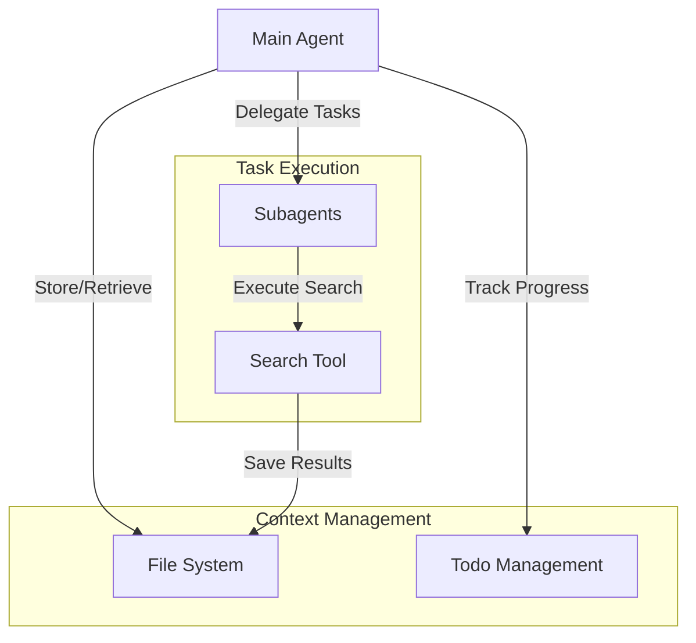
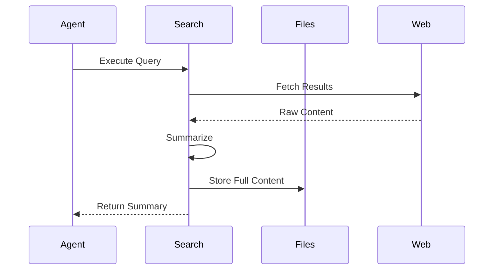
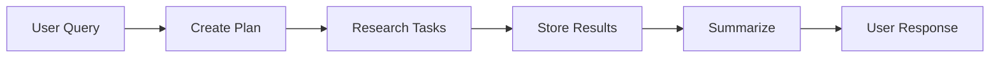
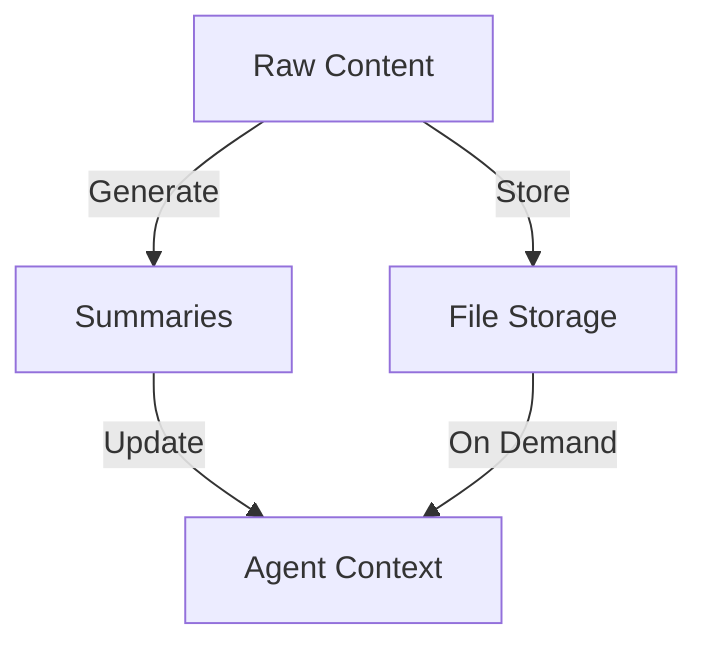

# Full Deep Agent Implementation

This document summarizes the implementation of a complete deep agent that combines todos, file systems, and subagents for sophisticated task handling.

## Core Architecture



## Components Overview

### 1. Search Tool Implementation



#### Key Components:
1. **Search Execution**
   - Uses Tavily API
   - Configurable results count
   - Topic filtering

2. **Content Processing**
   - HTML to Markdown conversion
   - Content summarization
   - File storage management

### 2. Research Tools

```python
class Summary(BaseModel):
    """Content summarization schema"""
    filename: str
    summary: str

@tool
def tavily_search(
    query: str,
    state: InjectedState,
    tool_call_id: InjectedToolCallId,
    max_results: int = 1,
    topic: Literal["general", "news", "finance"] = "general"
) -> Command:
    """Search implementation"""
```

## Implementation Details

### 1. Core Search Functions

```python
def run_tavily_search(
    search_query: str, 
    max_results: int = 1, 
    topic: str = "general", 
    include_raw_content: bool = True
) -> dict:
    """Execute Tavily search"""

def process_search_results(
    results: dict
) -> list[dict]:
    """Process and summarize results"""

def summarize_webpage_content(
    webpage_content: str
) -> Summary:
    """Generate content summary"""
```

### 2. Agent Configuration

```python
# Tool Configuration
sub_agent_tools = [tavily_search, think_tool]
built_in_tools = [ls, read_file, write_file, write_todos, read_todos, think_tool]

# Subagent Setup
research_sub_agent = {
    "name": "research-agent",
    "description": "Research delegation agent",
    "prompt": RESEARCHER_INSTRUCTIONS,
    "tools": ["tavily_search", "think_tool"]
}

# Agent Creation
agent = create_react_agent(
    model, 
    all_tools, 
    prompt=INSTRUCTIONS, 
    state_schema=DeepAgentState
)
```

## Workflow Process

### 1. Research Process



1. **Planning Phase**
   - Create todos
   - Plan research strategy
   - Allocate tasks

2. **Execution Phase**
   - Delegate to subagents
   - Store results
   - Track progress

3. **Synthesis Phase**
   - Gather results
   - Compile response
   - Update status

### 2. Context Management



## Advanced Features

### 1. Think Tool Integration

```python
@tool
def think_tool(reflection: str) -> str:
    """Strategic reflection tool"""
    return f"Reflection recorded: {reflection}"
```

Usage patterns:
1. After search results
2. Before next steps
3. Gap assessment
4. Completion evaluation

### 2. File Management

1. **Content Storage**
```python
file_content = f"""
# Search Result: {title}
**URL:** {url}
**Query:** {query}
**Date:** {date}

## Summary
{summary}

## Raw Content
{raw_content}
"""
```

2. **Result Organization**
   - Unique filenames
   - Structured content
   - Metadata inclusion

## Best Practices

### 1. Search Execution

1. **Query Formation**
   - Specific queries
   - Topic filtering
   - Result limiting

2. **Content Processing**
   - HTML cleanup
   - Summary generation
   - File organization

### 2. Agent Coordination

1. **Task Distribution**
   - Clear task boundaries
   - Context isolation
   - Result aggregation

2. **State Management**
   - File system updates
   - Todo tracking
   - Progress monitoring

## Practical Applications

### 1. Research Tasks

1. **Information Gathering**
   - Web search
   - Content processing
   - Result storage

2. **Analysis**
   - Content summarization
   - Gap identification
   - Progress tracking

### 2. Complex Workflows

1. **Task Management**
   - Todo tracking
   - Progress monitoring
   - Result synthesis

2. **Context Engineering**
   - Content offloading
   - Summary generation
   - State management

## Package Usage

The `deepagents` package provides a simplified interface:

```python
from deepagents import create_deep_agent

agent = create_deep_agent(
    sub_agent_tools,
    INSTRUCTIONS,
    subagents=[research_sub_agent],
    model=model
)
```

### Features Included:
1. File system tools
2. Todo management
3. Task delegation
4. Context management

### Required Configuration:
1. Subagent definition
2. Tool selection
3. Model specification
4. Instructions setup